# Genoma Invaders - Getting Started in Unity 2D Game Development

This tutorial covers some basic concepts about start developing 2D games in Unity. Game Object, Components, Sprites, how to handle Pixel Art for games in Unity, and helps to get used to Unity editor interface.

## Requirements

To follow this Unity tutorial you will need to:

- [Install UnityHub](https://unity3d.com/es/get-unity/download)
- [Install Unity](/tutorials/unity/2020/07/02/how-to-install-unity-2020/)
- [Create a new 2D Game Unity Project](/tutorials/unity/2020/07/16/how-to-create-a-unity-2d-project/)
- [Have basic knowledge about Unity's interface](https://docs.unity3d.com/2020.1/Documentation/Manual/UsingTheEditor.html)

## Genoma Invaders Game

The game we will be developing during this tutorial series is **Genoma Invaders**.

> Genoma Invaders is a [Fixed shooter](https://en.wikipedia.org/wiki/Category:Fixed_shooters) from the [Shoot 'em up](https://en.wikipedia.org/wiki/Shoot_%27em_up) game genre where you are a microscopic submarine killing bacteria, virus, and other microorganisms inside a human body.

To define this project and its scope a very simple [Game Design Document](https://github.com/GenomaGames/genoma-invaders/tree/tutorial/01/docs/game-design-document.md) has been created.

<small>_**Note:** Don't use this project as an example for game design as there is not much design process behind this project due to its educational purpose_</small>

## Project File Structure

It is not mandatory, but a way to keep things tidy is to create a new directory inside `/Assets` with the name of your game, in this case, `/Assets/Genoma Invaders`, and move the `Scenes` directory inside of it. This way, all the game-related assets are contained inside this directory so they do not get mixed with 3rd party assets or plugins.

## Building the First Game Scene

Let's start with the [**Scene**](https://docs.unity3d.com/2020.1/Documentation/Manual/CreatingScenes.html) Unity creates whenever you create a new project by renaming it from `SampleScene` to `Game`. Here is where all the game action will happen.

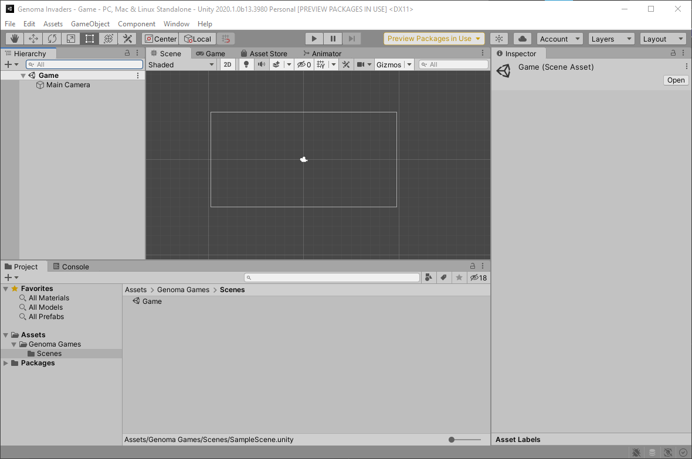

Every game in Unity is contained within one or multiple scenes. For this project, we will be using them to store one level in each one and the main menu in another one, but for now, we only need one to start our game development.

### Game Objects

The next item smaller than a Unity scene is a [**Game Object**](https://docs.unity3d.com/2020.1/Documentation/Manual/GameObjects.html). They comprehend the bricks to build a game, graphics, sounds, and logic. A Game Object can represent multiple things in a Unity game, players, enemies, lights, the ground, trees, cameras. These objects can also represent things that the player can not see, like the camera itself or an object in charge of reviving the player whenever it dies.

Unity starts a project always by placing a [**Camera**](https://docs.unity3d.com/2020.1/Documentation/Manual/class-Camera.html) Game Object inside the Scene (depending on the project template it could put more stuff). A Camera is essential since it represents the player's eyes as they will see what the camera sees. Do not mind it too much since we will not be handling it yet.  

A Game Object will represent the player. To create Game Objects in the Scene, click on the menu `GameObject > 2D Object > Sprite`.

It will create a new Game Object in the Scene called `New Sprite`. Rename it to `Player` and ensure its position is in `X=0 Y=0 Z=0` in the [**Inspector window**](https://docs.unity3d.com/2020.1/Documentation/Manual/UsingTheInspector.html).

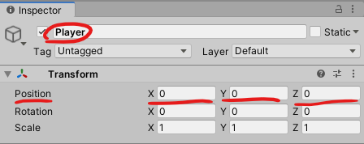

### Components

This Game Object we renamed `Player` should show a **Sprite Renderer** in the Inspector window.

Each section in the Inspector window, divided by a line and a header, represents a [**Component**](https://docs.unity3d.com/2020.1/Documentation/Manual/Components.html) which is the next piece smaller than a Game Object. Game Objects contains Components that provide different features to the Game Object, the most common Component you can find in a Game Object is the [**Transform**](https://docs.unity3d.com/2020.1/Documentation/Manual/class-Transform.html) Component. It gives the Game Object the ability to be positioned, rotated, or scaled inside the Scene, so if the Game Object renders something, it will be placed based on that values or could calculate its distance against other entities in the Scene.

### Sprites

Time to inject some graphics into the game. Take this [Player sprite](../assets/lesson-01/Player.png):

And put it into the project. You can do it by dragging it into the [**Project window**](https://docs.unity3d.com/2020.1/Documentation/Manual/ProjectView.html) or placing it with your operating system file explorer into the project `Assets` directory. Place it under `Assets/Genoma Invaders/Player/Player.png`.

Let assign the Player sprite to the Player Game Object in the Scene:

1. Select the Player in the Scene [**Hierarchy window**](https://docs.unity3d.com/2020.1/Documentation/Manual/Hierarchy.html)
1. In the Inspector window, on the **Sprite Renderer** component, click on the circle of the left to the Sprite field to open the **Select Sprite** window
1. Select the Player sprite on the Select Sprite window

Now the Player entity is visible within the game Camera. To check this, go to the [**Game view**](https://docs.unity3d.com/2020.1/Documentation/Manual/GameView.html) view, you should see something like this:

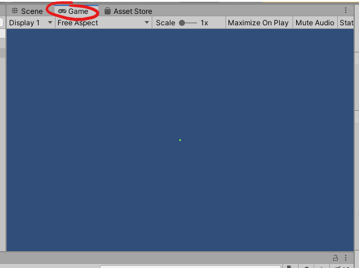

That little dot is our **Player** rendered by the camera. The reason it is so small is that the size of the sprite is 16x16 pixels. Sprites, Cameras, and settings in Unity need to be configured to render [Pixel Art](https://en.wikipedia.org/wiki/Pixel_art) correctly.

## Pixel Art in Unity

To render pixel art correctly in Unity, we need to make a few changes.

### Unity Texture 2D Import Settings for Pixel Art

The primary problem Unity has with Pixel Art is that it treats the images used for the Game Objects as Textures, and it applies some optimization over them to improve load and render times. The problem is that that optimization is useful only if we are working with large resolution images that need to be compressed or optimized. In the case of Pixel Art, these optimizations are not required since these graphics are so small in size. 

To configure Player Sprite with proper settings, select it on the Project window to display its settings on the Inspector window.

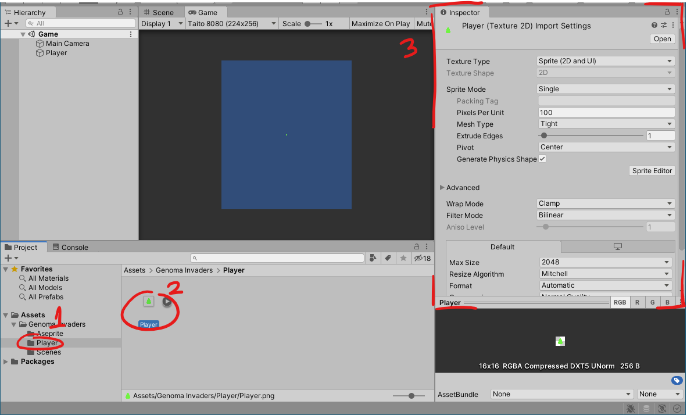

- **Pixels Per Unit**: 16 (It will make the sprite bigger in the Scene because when applying this value, it means that for this sprite 16 pixels will have to be rendered inside 1 game world unit)
- **Filter Mode**: Point (no filter) (Will prevent blurriness with the pixels since that option is in charge of filtering the texture when it gets stretched)
- **Compression**: None (This prevents Unity from compressing the image that also will cause blurriness)

Press the **Apply** button to save the changes.

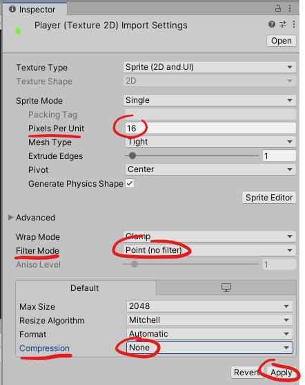

<small>_**Note:** This process needs to be made with every sprite included in the project._</small>

If you look now in the Game view, the Player Sprite should look bigger.

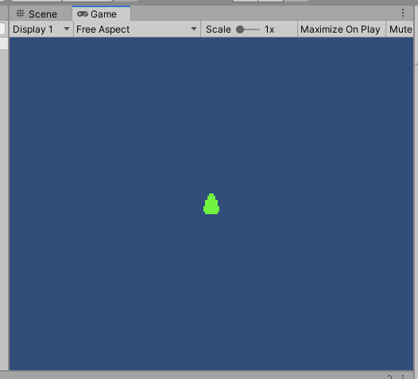

### 2D Pixel Perfect Package

Another tweak we can do to help the Unity project render pixel graphics is to install the [**2D Pixel Perfect**](https://docs.unity3d.com/Packages/com.unity.2d.pixel-perfect@3.0/manual/index.html) package.

#### 2D Pixel Perfect Package Installation

**If you created the project selecting the 2D Project Template in Unity Hub you already have this package installed**.

To install the package, open the **Package Manager** window.

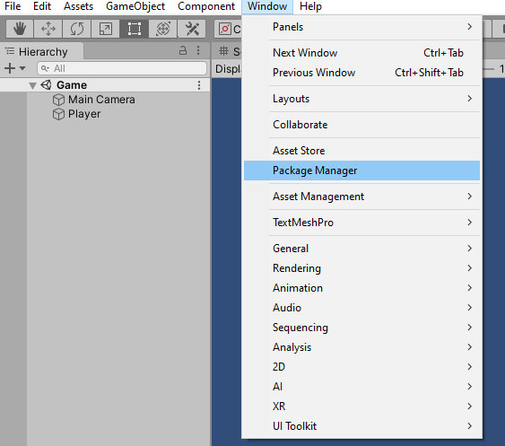

Set **Packages** option to show **All** packages.

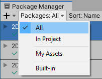

Select the **2D Pixel Perfect** package and the press the **Install** button.

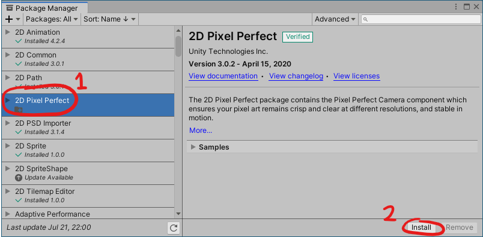

#### 2D Pixel Perfect Package's Pixel Camera

The **2D Pixel Perfect** package comes with a **Component** called **Pixel Camera**. Unity Cameras are not prepared to render pixel graphics correctly, and this Component provides Unity's Cameras with behavior to handle pixel viewport logics and other features to help your game look more pixelated.

Select the **Main Camera** in the Hierarchy window to show its Inspector window. To add the **Pixel Camera** Component to the Main Camera, click on the **Add Component** button. Go to **Rendering** and then select **Pixel Perfect Camera** (you can also find it using the search input).

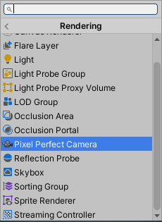

Once the Main Camera has the Pixel Perfect Camera Component, edit its parameters.

- **Assets Pixels Per Unit:** 16 (the same value we used for the Player Sprite)
- **Reference Resolution:** 224x256 (you'll know why these values later)
- **Upscale Render Texture:** checked
- **Crop Frame:** X and Y checked

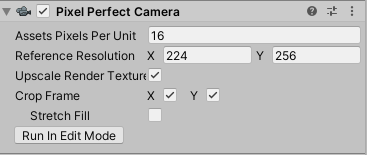

<small>_**Note:** checkout [2D Pixel Perfect package documentation](https://docs.unity3d.com/Packages/com.unity.2d.pixel-perfect@3.0/manual/index.html) for more info._</small>

### Arcade Cabinet Taito 8080

[Space Invaders](https://en.wikipedia.org/wiki/Space_Invaders) were played in an [arcade cabinet](https://en.wikipedia.org/wiki/Arcade_cabinet) with a [Taito 8080](https://www.system16.com/hardware.php?id=629) motherboard which could render a resolution of 224x256 pixels.

Unity can simulate resolutions and aspect ratios freely. Let's begin by setting up a new **Aspect** configuration on the Game view:

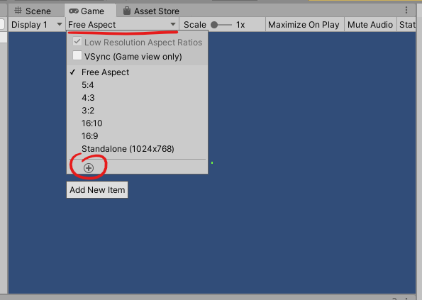

To simulate a Taito arcade machine create a mew aspect with 224 with and 256 height:

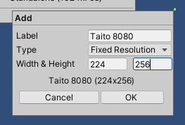

When the new aspect is selected, the Game view will change to represent this resolution. To try how the game looks under this resolution, press the **Play** button and select it.

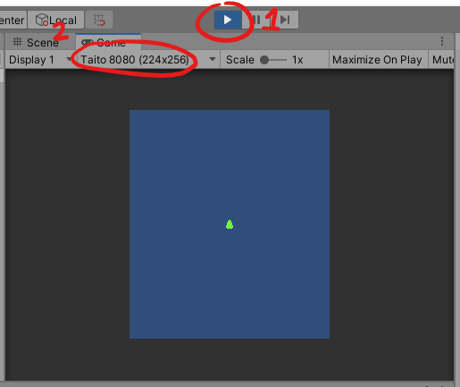

Stop the game by pressing the **Play** button again.

## Enemies

Let's make the same process with this [Enemy sprite](../assets/lesson-01/Enemy.png):

Place it under `/Assets/Genoma Invaders/Enemy/Enemy.png` and update its settings as we did with the Player sprite.

- Pixels Per Unit: 16
- Filter Mode: Point (no filter)
- Compression: None

Now, to create the Enemy Game Object in the Scene, there is another way to create it. Drag and drop the Enemy Sprite from the Project window to the Hierarchy window, this will create a new Game Object with a Sprite Renderer Component called "Enemy" in the Scene. 

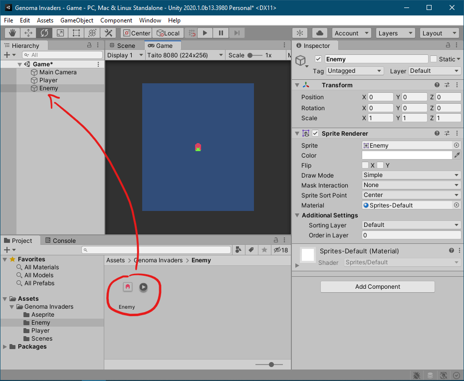

Now that we have two visible game objects in the Scene let's place them where they suppose to be in the game. Move the Player and the Enemy to be positioned similar to this.

Now select the Enemy Game Object and press <kbd>Ctrl/Cmd</kbd> + <kbd>D</kbd>, in the Hierarchy should appear an `Enemy (1)` Game Object, you have just duplicated a Game Object, place it next to its partner, and you should end with something that starts to smell like a game.

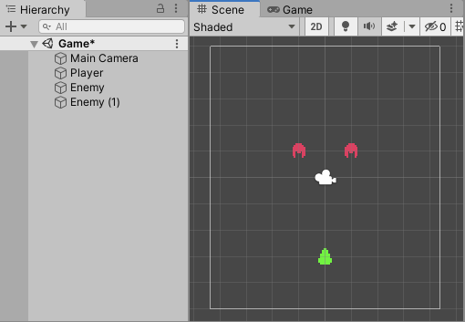

## Wrap Up

We have seen:

- How to import Sprites in a Unity project
- How to create Game Objects in Unity
- How to add components to a Game Object in Unity
- How to adapt a Unity project, its camera, and sprites to be Pixel Art friendly

This is all for now.

The resulting work of this tutorial can be checked out in the [Genoma Invaders Github, branch `tutorial/01`](https://github.com/GenomaGames/genoma-invaders/tree/tutorial/01).

Happy Game Dev! :space_invader: