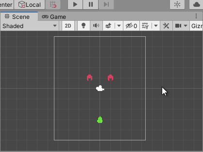

# Genoma Invaders - How to Move 2D Object in Unity

This tutorial shows **basics for Unity 2D Game Development like, adding custom components to Game Object, basic Unity scripting with C# and 2D Game Object movement in Unity**.

We are not going to go through details about the structure of code and Unity API in this tutorial as we want to see results as early as possible. To get more info about this topics you can refer to [Unity's Manual section "Creating and Using Scripts"](https://docs.unity3d.com/2020.1/Documentation/Manual/CreatingAndUsingScripts.html), [Unity API Scripting Reference](https://docs.unity3d.com/2020.1/Documentation/ScriptReference/index.html) and [Unity Learn](https://learn.unity.com/)


This time we will **learn to move 2D Object in Unity by scripting in C# using Game Components**.

## Requirements

- To have completed ["**Getting Started in Unity 2D Game Development**"](../_tutorials/01-getting-started-with-unity-2d-game-development.md)
- [Have **basics knowledge in programming with C#**](https://www.codecademy.com/learn/learn-c-sharp)
  
  Due to the intention of this course, we will not cover knowledge about programming in C# but rather provide info with complex terms in the language or Unity API. The link provided should give you enough knowledge to complete this lesson once you finish it.
- [**Visual Studio Editor**](https://visualstudio.microsoft.com/es/vs/) (you should have installed it when installing Unity) or other code editor of your preference.

In the previous tutorial about "Getting Started in Unity 2D Game Development", we walk through basic concepts about start developing 2D games in Unity ending up with a scene with some still Game Objects. It time to give them some movement logic starting by the Player.

## Custom Components

To move our Player we will need to add some logic to its dumb Game Object. We will do it by creating a Custom Component containing C# code and adding it to the Player Game Object.

Select the Player Game Object and press the "Add Component" button in the Inspector window. Then, write in the search input `Player`, select `New Script` and press the "Create and Add" button.


<small>_**Note:** checkout [Unity's Manual section "Creating components with scripting"](https://docs.unity3d.com/2020.1/Documentation/Manual/CreatingComponents.html) for more info._</small>

This will create a C# file under `/Assets/Player.cs` that defines a component named "Player" and then it will add this component to the Player Game Object. Move the `Player.cs` file to `/Assets/Genoma Invaders/Player/` directory using the Project window to maintain the project's files organized.

### Player Controller

The Player component will be the Player Controller or, in other words, the component in charge of handle the player's logic.

If you open the file you'll see this:

**`Player.cs`**
```csharp
using System.Collections;
using System.Collections.Generic;
using UnityEngine;

public class Player : MonoBehaviour
{
    // Start is called before the first frame update
    void Start()
    {
        
    }

    // Update is called once per frame
    void Update()
    {
        
    }
}

```

That is the basic code structure Unity Editor creates for every script/component created in the project.

We are going to clean it up a bit so it doesn't have unnecessary code:

**`Player.cs`**
```csharp
using UnityEngine;

public class Player : MonoBehaviour
{
    void Update()
    {
    }
}

```

### Movement

To make the Player Game Object move we are going to add some logic into its Player Controller's update loop:

**`Player.cs`**
```csharp
using UnityEngine;

public class Player : MonoBehaviour
{
    void Update()
    {
        // https://docs.unity3d.com/2020.1/Documentation/ScriptReference/Vector3-right.html
        Vector3 right = Vector3.right;

        // https://docs.unity3d.com/2020.1/Documentation/ScriptReference/Time-deltaTime.html
        float timeSinceLastFrame = Time.deltaTime;

        Vector3 translation = right * timeSinceLastFrame;

        // https://docs.unity3d.com/2020.1/Documentation/ScriptReference/Transform.Translate.html
        transform.Translate(
          translation
        );
    }
}

```
<small>_**Note:** Visit any of the links in the code's comments for more info._</small>


This code is creating a [`Vector3`](https://docs.unity3d.com/2020.1/Documentation/ScriptReference/Vector3.html) pointing to the right (1, 0, 0) and multiplying it by time elapsed since the last frame, the resulting Vector3 is then passed to the [`Transform.Translate`](https://docs.unity3d.com/2020.1/Documentation/ScriptReference/Transform.Translate.html) method which will move the Game Object that distance.

TL;DR; This will make the player move 1 Scene unit per second to the right.

To see the result go to Unity Editor and press the "Play" button (You can als use the keyboard shortcut <kbd>Ctrl/Cmd</kbd>+<kbd>P</kbd>).



It's alive!!!

