# Genoma Invaders - How to Move 2D Objects in Unity

This tutorial shows **basics for Unity 2D Game Development concepts like adding custom components to Game Object, fundamental Unity scripting with C#, 2D Game Object movement in Unity, how to handle inputs in Unity, and how to instantiate Game Object in Unity**.

We are not going to go through details about the structure of code and Unity API in this tutorial as we want to see results as early as possible. To get more info about this topics, you can refer to [Unity's Manual section "Creating and Using Scripts"](https://docs.unity3d.com/2020.1/Documentation/Manual/CreatingAndUsingScripts.html), [Unity API Scripting Reference](https://docs.unity3d.com/2020.1/Documentation/ScriptReference/index.html) and [Unity Learn](https://learn.unity.com/)

## Requirements

- To have completed ["**Getting Started in Unity 2D Game Development**"](../_tutorials/01-getting-started-with-unity-2d-game-development.md)
- [Have **basics knowledge in programming with C#**](https://www.codecademy.com/learn/learn-c-sharp)
  
  <small>_**Note:** Due to this course's intention, we will not cover knowledge about programming in C# but rather provide info with complex terms in the language or Unity API. The link provided should give you enough experience to complete this lesson once you finish it._</small>
- [**Visual Studio Editor**](https://visualstudio.microsoft.com/es/vs/) (you should have installed it when installing Unity) or another code editor of your preference.

In the previous tutorial, ["Getting Started in Unity 2D Game Development"](../_tutorials/01-getting-started-with-unity-2d-game-development.md), we walk through basic concepts about developing 2D games in Unity, ending up with a scene with some still Game Objects. It's time to give them some movement logic starting by the Player.

This time we will **learn to move 2D Object in Unity by scripting in C# using Game Components**.

## Custom Components

To move our Player, we will need to add some logic to its dumb Game Object. We will do it by creating a Custom Component containing C# code and adding it to the Player Game Object.

Select the Player Game Object and press the "Add Component" button in the Inspector window. Then, write in the search input `Player`, select `New Script`, and press the "Create and Add" button.

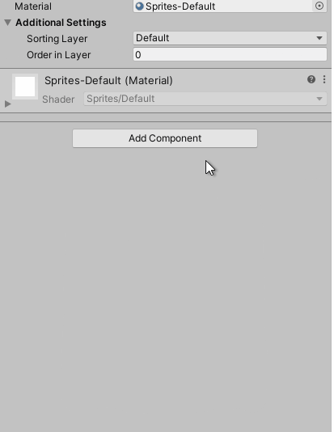

<small>_**Note:** checkout [Unity's Manual section "Creating components with scripting"](https://docs.unity3d.com/2020.1/Documentation/Manual/CreatingComponents.html) for more info._</small>

This action will create a C# file under `/Assets/Player.cs` that defines a component named "Player", and then it will add this Component to the Player Game Object. Move the `Player.cs` file to `/Assets/Genoma Invaders/Player/` directory using the Project window to maintain the project's files organized.

## Player Controller

The Player component will be the Player Controller or, in other words, the Component in charge of handle the player's logic.

If you open the file you'll see this:

**`Player.cs`**
```csharp
using System.Collections;
using System.Collections.Generic;
using UnityEngine;

public class Player : MonoBehaviour
{
    // Start is called before the first frame update
    void Start()
    {
        
    }

    // Update is called once per frame
    void Update()
    {
        
    }
}

```

That is the basic code structure Unity Editor creates for every script/component created in the project.

Now we are going to make de same, and **create an Enemy Custom Component for the Enemy Game Objects**. This time we are using a different technique. On the Project window, go to `/Assets/Genoma Games/Enemy` right click on it to open the contextual menu and select `Create > C# Script`, then name the file `Enemy`.

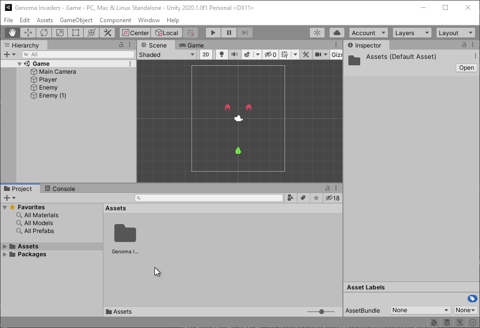

When `Enemy.cs` file is created, Unity reloads for a sort time and will register a new component to be added to Game Object named `Enemy`. Go ahead and add it to both Enemy Game Objects.

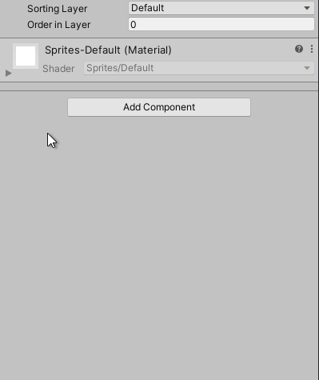

<small>_**Note:** Remember to add the Enemy component to both enemies._</small>

## Game Object Movement

To make the Player Game Object move, edit `Player.cs` file. First, we will clean it up a bit, so it doesn't have unnecessary code:

**`Player.cs`**
```csharp
using UnityEngine;

public class Player : MonoBehaviour
{
    private void Update()
    {
    }
}

```

Now, we will add some logic into its Player Controller's [`Update`](https://docs.unity3d.com/2020.1/Documentation/ScriptReference/MonoBehaviour.Update.html) loop method.

**`Player.cs`**
```csharp
using UnityEngine;

public class Player : MonoBehaviour
{
    private void Update()
    {
        // https://docs.unity3d.com/2020.1/Documentation/ScriptReference/Vector3-right.html
        Vector3 right = Vector3.right;

        // https://docs.unity3d.com/2020.1/Documentation/ScriptReference/Time-deltaTime.html
        float timeSinceLastFrame = Time.deltaTime;

        Vector3 translation = right * timeSinceLastFrame;

        // https://docs.unity3d.com/2020.1/Documentation/ScriptReference/Transform.Translate.html
        transform.Translate(
          translation
        );
    }
}

```

<small>_**Note:** Visit any of the links in the code's comments for more info._</small>


This code is creating a [`Vector3`](https://docs.unity3d.com/2020.1/Documentation/ScriptReference/Vector3.html) pointing to the right (1, 0, 0) and multiplying it by time elapsed since the last frame, and then calls  [`Transform.Translate`](https://docs.unity3d.com/2020.1/Documentation/ScriptReference/Transform.Translate.html) method with the resulting Vector3  which will move the Game Object that distance.

TL;DR; This will make the player move 1 Scene unit per second to the right.

To see the result go to Unity Editor and press the "Play" button (You can use the keyboard shortcut <kbd>Ctrl/Cmd</kbd>+<kbd>P</kbd>).

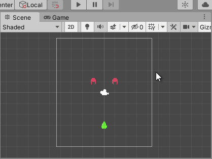

It's alive!!! But we need to be able to control this little guy.

## Detect Player Input

To control the Player, we need to use Unity's [Input Manager](https://docs.unity3d.com/2020.1/Documentation/Manual/class-InputManager.html). With the [`Input.GetAxisRaw`](https://docs.unity3d.com/ScriptReference/Input.GetAxisRaw.html) method, you can retrieve the corresponding axis input value, in this case, if some left or right key is pressed.

**`Player.cs`**
```csharp
using UnityEngine;

public class Player : MonoBehaviour
{
    private void Update()
    {
        // https://docs.unity3d.com/ScriptReference/Input.GetAxisRaw.html
        float rawHorizontalAxis = Input.GetAxisRaw("Horizontal");

        // https://docs.unity3d.com/2020.1/Documentation/ScriptReference/Vector3-zero.html
        Vector3 direction = Vector3.zero;
        direction.x = rawHorizontalAxis;

        // https://docs.unity3d.com/2020.1/Documentation/ScriptReference/Time-deltaTime.html
        float timeSinceLastFrame = Time.deltaTime;

        Vector3 translation = direction * timeSinceLastFrame;

        // https://docs.unity3d.com/2020.1/Documentation/ScriptReference/Transform.Translate.html
        transform.Translate(
          translation
        );
    }
}

```

Now you can control the player.

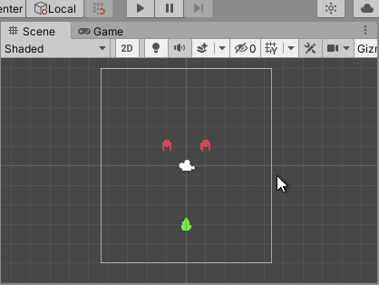

The problem is, it is a bit slow. To fix this, we are going to add one more value to our player logic. Edit the Player component code, add a `speed` property to it, and include this value in the `translation` calculus.

**`Player.cs`**
```csharp
using UnityEngine;

public class Player : MonoBehaviour
{
    private float speed = 2;

    private void Update()
    {
        // ...

        Vector3 translation = direction * speed * timeSinceLastFrame;

        // ...
    }
}

```

<small>_**Note:** Some code has been hidden under `// ...` to show only applied changed._</small>

Now the Player should move twice as fast if you try it. But there is one small problem here if we want to change our Player speed value we need to open its code and edit the value and then wait for Unity to recompile. Unity provides various ways to allow the exposure of properties in the editor so you can tweak as many values as you want without editing any code. You could set the property to be [`public`](https://docs.microsoft.com/en-us/dotnet/csharp/programming-guide/classes-and-structs/access-modifiers) (which I don't recommend to enforce [code cleanliness](https://en.wikipedia.org/wiki/SOLID)), or you could add the [`SerializeField`](https://docs.unity3d.com/ScriptReference/SerializeField.html) attribute to the Player's `speed` property, we will do the second.

**`Player.cs`**
```csharp
using UnityEngine;

public class Player : MonoBehaviour
{
    [SerializeField]
    private float speed = 2;

    // ...
}

```

Now, if you go to the Unity Editor and checkout the Player Component at the Inspector window, you'll see that now the Component has a new input called `Speed`.

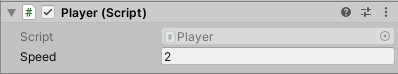

Now the `2` we set for the `speed` property will be a default value when the Component is added to a Game Object, and the final used value for the logic will be the one set at the editor. You can edit it even while playing to adjust it to your preferred value.

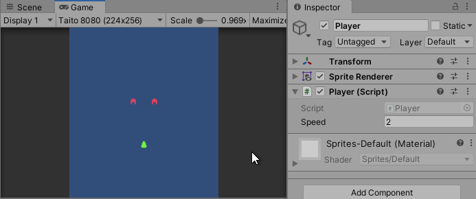

<small>_**Note:** Properties changed during Play mode will not be saved and will reset to its value before stating Play mode. More info in Unity's Manual section "[Game View](https://docs.unity3d.com/2020.1/Documentation/Manual/GameView.html)"_</small>

## Instantiate Game Objects

Time to make our Player shoot some bullets. Download this Bullet sprite:


And place it under `/Assets/Bullet/` (new directory). Remember to edit the Sprite settings as we did with the Player and Enemy sprites in the [previous tutorial](../_tutorials/01-getting-started-with-unity-2d-game-development.md). Then use it to create a new Game Object in the Scene called Bullet.

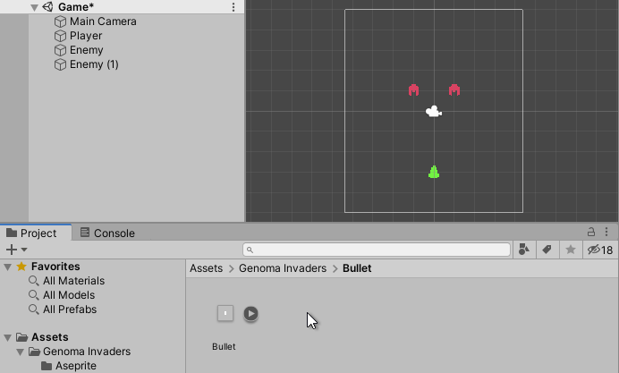

This Bullet Game Object will need custom logic to move and do stuff, so let's create a new C# Script called Bullet and add its Component to the Bullet Game Object. Edit the file.

**`Bullet.cs`**
```csharp
using UnityEngine;

public class Bullet : MonoBehaviour
{
    [SerializeField]
    private float speed = 5;

    private void Update()
    {
        // https://docs.unity3d.com/2020.1/Documentation/ScriptReference/Vector3-up.html
        Vector3 direction = Vector3.up;

        // https://docs.unity3d.com/2020.1/Documentation/ScriptReference/Time-deltaTime.html
        float timeSinceLastFrame = Time.deltaTime;

        Vector3 translation = direction * speed * timeSinceLastFrame;

        // https://docs.unity3d.com/2020.1/Documentation/ScriptReference/Transform.Translate.html
        transform.Translate(
          translation
        );
    }
}

```

We have added similar logic to our Bullet Game Object as we did to the player, but this time it only moves upwards and with a higher speed.

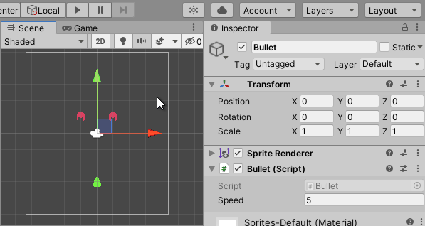

The problem now is that we only have one Bullet, and it appears and starts moving whenever we start playing. We need it only to appear when we are pressing the fire button. To achieve this, we will need to create a [Prefab](https://docs.unity3d.com/2020.1/Documentation/Manual/Prefabs.html) from our Bullet Game Object.

To **create a Unity Prefab** from an already existing Game Object, you need to drag and drop it to the Project window.

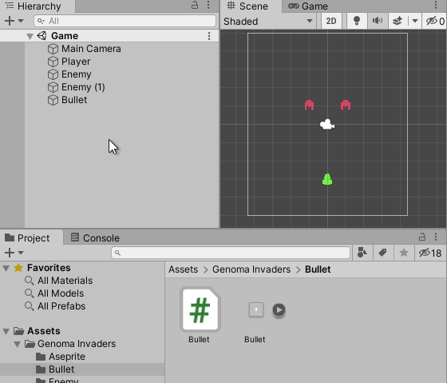

A Prefab is like a blueprint of a Game Object. It allows us to create multiple copies of the same Game Object without having them in the Scene. If you take a look at the Hierarchy window, you will see that the Bullet Game Object now has a different color, icon, and a little arrow to the right, this is the way Unity indicates if a Game Object in the Scene is related with a Prefab. Delete this Game Object from the Scene.

Check the Bullet Prefab properties within the Inspector window and ensure that it has Transform.position to `x=0 y=0 z=0` and Bullet `speed=0`. We need to update the Player's logic to instantiate this Game Object whenever we press the "Fire1" button (which is mapped to `left ctrl`, `mouse 0` and `joystick button 0`).

<small>_**Note:** Checkout [Unity's Manual section "Input Manager"](https://docs.unity3d.com/2020.1/Documentation/Manual/class-InputManager.html) to know more on how to configure input mappings._</small>

**`Player.cs`**
```csharp
using UnityEngine;

public class Player : MonoBehaviour
{
    // ...

    [SerializeField]
    private GameObject bullet;

    private void Update()
    {
        // ...

        // https://docs.unity3d.com/ScriptReference/Input.GetButtonDown.html
        if (Input.GetButtonDown("Fire1"))
        {
            Vector3 playerPosition = transform.position;

            // https://docs.unity3d.com/2020.1/Documentation/ScriptReference/Quaternion-identity.html
            Instantiate(bullet, playerPosition, Quaternion.identity);
        }
    }
}

```
<small>_**Note:** Some code has been hidden under `// ...` to show only applied changed._</small>

We have defined a new Player Component property called `bullet` that will store the reference to the Bullet Prefab Game Object. Then we have updated the `Update` with more code to check if any input mapped to the button "Fire1" has been pressed down during this frame, if it has, then the script will instantiate a new Bullet Game Object in the Scene at the Player's position (with no rotation). Select the Player Game Object in the Scene and update its properties in the Inspector window dragging the Bullet prefab to its Bullet property in the Player Component.

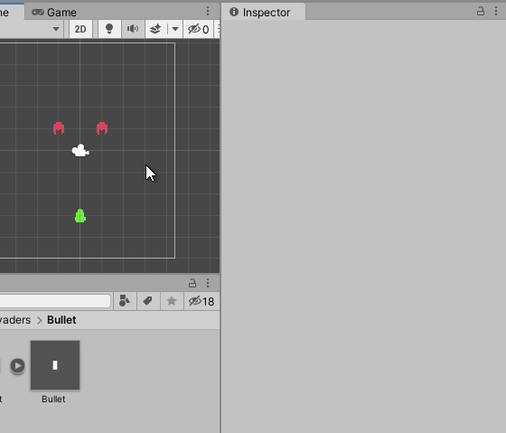

Now you are ready to fire!!!

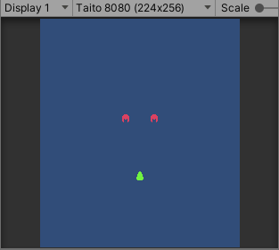

## Conclusion

Summing Up we have:

- Add a new custom Player Component made with C# to our Player Game Object
- Implement moving mechanics to the Player and Bullet Game Objects
- Handle Player Inputs to move and shoot Bullets

You can get the code generated by following this tutorial in [Genoma Invaders Github repository, branch `tutorial/02`](https://github.com/GenomaGames/genoma-invaders/tree/tutorial/02).

Remember to dig into documentation sites to have more context on what does what:
- [Unity 2020.1 Manual](https://docs.unity3d.com/2020.1/Documentation/Manual/index.html)
- [Unity 2020.1 Script Reference](https://docs.unity3d.com/2020.1/Documentation/ScriptReference/index.html)
- [Microsoft .NET C# Documentation](https://docs.microsoft.com/en-us/dotnet/csharp/)

Happy Game Dev! :space_invader: