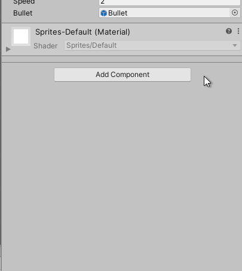
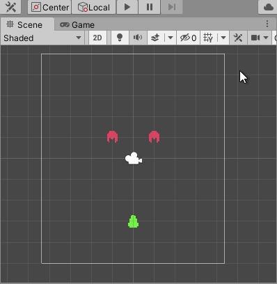
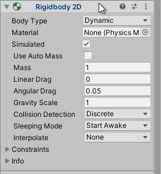
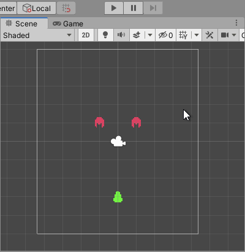

# Genoma Invaders - Unity Physics 2D Using Collider2D and Kinematic Rigidbody2D

Learn how to handle 2D game objects collisions, while making a space invaders 2D game, using the Unity physics 2D engine with help of 2D colliders and kinematic 2D rigid bodies.


## Requirements

- Complete ["**How to Move 2D Objects in Unity**"](../_tutorials/02-how-to-move-2d-objects-in-unity.md) or checkout the code from [Genoma Invaders' Github repository, branch `tutorial/02`](https://github.com/GenomaGames/genoma-invaders/tree/tutorial/02)
- [**Unity 2020.1**](https://store.unity.com/download?ref=personal)
- [**Visual Studio Editor**](https://visualstudio.microsoft.com/es/vs/)


## Intro

In the last tutorial, we walked through **How to Move 2D Objects in Unity** using Unity's Scripting API ending up with a Scene containing a Player Game Object that moves when pressing directional input buttons and shooting bullets that move upwards in a constant manner when a `Fire1` related input is pressed.

Our next steps will be to:
- Make Bullets collide with the Enemies
- Avoid Player to get out of screen
- Organize our code

Until now the Game Objects of our game were moving by updating its [`Transform.position`](https://docs.unity3d.com/2020.1/Documentation/ScriptReference/Transform-position.html) values by calling [`Transform.Translate`](https://docs.unity3d.com/2020.1/Documentation/ScriptReference/Transform.Translate.html) method. But, to let Unity detect collisions between objects this is a bad practice, we need to change this approach to make use of Unity's Physics 2D engine, so it can notifies us about collision between Game Objects.

## Unity's Kinematic Rigidbody2D, Moving Objects with Physics

In order to move Game Objects using Unity's 2D Physics we need to add [`Rigidbody2D`](https://docs.unity3d.com/2020.1/Documentation/Manual/class-Rigidbody2D.html) Component to them and call [`Rigidbody2D.MovePosition`](https://docs.unity3d.com/2020.1/Documentation/ScriptReference/Rigidbody2D.MovePosition.html) to move them, this way the Physics2D engine can handle the movement and take care of the physics calculations implied on it.

Let's start with the Player Game Object adding the Rigidbody2D component to it.



Now there is a small point in adding physics to game objects in Unity, if you play the game you will see how our Player Game Object now falls into the abyss.



<small>_"Goodbye dear friend!"_</small>

This is because now Unity's 2D Physics engine is now applying gravity to the Player Game Object. The thing is, we don't want gravity in this game and neither to have inertia in our Game Objects. We want them to move whenever we want them to move. This means we are only going to use the Unity's 2D Physics engine to collision detection. To achieve this whe need to switch the [`Rigidbody2D.bodyType`](https://docs.unity3d.com/2020.1/Documentation/Manual/class-Rigidbody2D.html) property.

Using the Unity Inspector window change the Player's Rigidbody2D Body Type property to `Kinematic`.



<small>_**Note:** Now if you play the game will see that the Player stay still._</small>

This will make the Game Object ignore all forces and collision applied to it so it will stay still unless moved by scripting. One thing more to do with the Rigidbody2D properties is to check "Use Full Kinematics Contacts" box in order to tell the Unity's 2D Physics engine that this object can collide with other kinematic objects.

<small>_**Note:** Checkout [**Unity's Manual section "Rigidbody 2D"**](https://docs.unity3d.com/2020.1/Documentation/Manual/class-Rigidbody2D.html) to have more context about this topic._</small>



There, our Player is now in position. Now it's time to update our Player's Component code in order to make use of `RigidBody2D` instead of `Transform`.

**`Player.cs`**

```csharp

```

Let's explain this changes. Our `Player` Component depends on the `RigidBody2D` Component to work properly,  use the `RigidBody2D` attached to the Game Object we need to obtain it with the [`Component.GetComponent`](https://docs.unity3d.com/2020.1/Documentation/ScriptReference/Component.GetComponent.html) method.


## Unity's Collider2D, Detecting Collisions

--


## Unity's Static Rigidbody2D

--


## Conclusion

--


Happy Game Dev! :space_invader:


### Enemy Controller

Now to coding, let do the same as we did for the Player component for the first time.

**`Enemy.cs`**
```csharp
using UnityEngine;

public class Enemy : MonoBehaviour
{
    void Update()
    {
        // https://docs.unity3d.com/2020.1/Documentation/ScriptReference/Vector3-right.html
        Vector3 right = Vector3.right;

        // https://docs.unity3d.com/2020.1/Documentation/ScriptReference/Time-deltaTime.html
        float timeSinceLastFrame = Time.deltaTime;

        Vector3 translation = right * timeSinceLastFrame;

        // https://docs.unity3d.com/2020.1/Documentation/ScriptReference/Transform.Translate.html
        transform.Translate(
          translation
        );
    }
}

```

Now our enemies are fleeing to the right further and further. Don't worry bout it now, we'll deal with them later.
