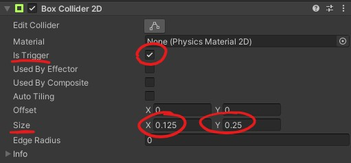
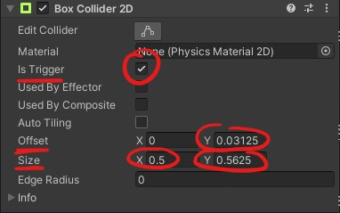
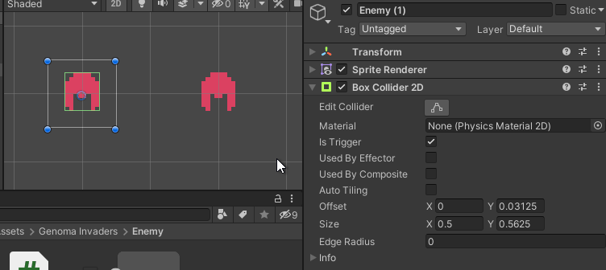
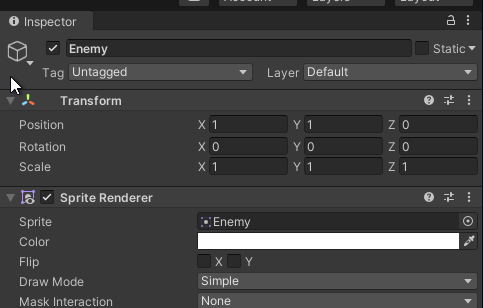
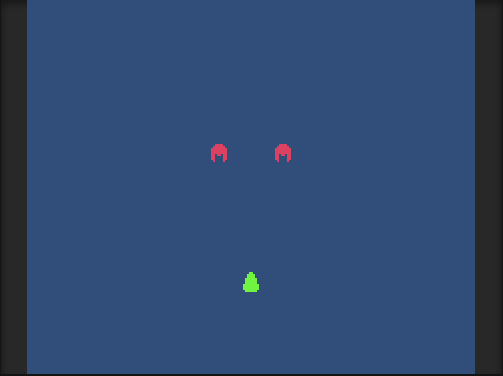

# Genoma Invaders - Unity Physics 2D Using Collider2D and Kinematic Rigidbody2D

Learn how to handle 2D game objects collisions while making a space invaders 2D game using the Unity physics 2D engine with 2D colliders and kinematic 2D rigid bodies.


## Requirements

- [**Unity 2020.1**](https://store.unity.com/download?ref=personal)
- [**Visual Studio Editor**](https://visualstudio.microsoft.com/vs/)
- Complete ["**How to Move 2D Objects in Unity**"](../_tutorials/02-how-to-move-2d-objects-in-unity.md) or checkout the code from [Genoma Invaders' Github repository, branch `tutorial/02`](https://github.com/GenomaGames/genoma-invaders/tree/tutorial/02)


## Intro

In the last tutorial, we walked through **How to Move 2D Objects in Unity** using the Unity's Scripting API, ending up with a Scene containing a Player Game Object that moves when pressing directional input buttons and shooting bullets that move upwards in a consistent manner when a `Fire1` related input is pressed.

Our next steps will be to:
- Make Bullets collide with the Enemies
- Organize our code

Until now, the Game Objects of our game were moving by updating its [`Transform.position`](https://docs.unity3d.com/2020.1/Documentation/ScriptReference/Transform-position.html) values by calling [`Transform.Translate`](https://docs.unity3d.com/2020.1/Documentation/ScriptReference/Transform.Translate.html) method. But, to let Unity detect collisions between objects, this is a bad practice, we need to change this approach to make use of Unity's Physics 2D engine so that it can notify us about collisions between Game Objects.

## Unity's Kinematic Rigidbody2D, Moving Objects with Physics

To move a Game Object using Unity's 2D Physics we need to add [`Rigidbody2D`](https://docs.unity3d.com/2020.1/Documentation/Manual/class-Rigidbody2D.html) Component to it and call [`Rigidbody2D.MovePosition`](https://docs.unity3d.com/2020.1/Documentation/ScriptReference/Rigidbody2D.MovePosition.html) to move it, this way the Physics2D engine can handle the movement and take care of the physics calculations implied on it.

### Player Movement with Physics

Let's start with the Player Game Object by adding the Rigidbody2D Component to it.


Now there is a small point in adding physics to game objects in Unity. If you play the game, you will see how our Player Game Object now falls into the abyss.


<small>_"Goodbye dear friend!"_</small>

The Player Game Object is falling because Unity's 2D Physics engine is now applying gravity to the Player Game Object. The thing is, we don't want gravity in this game. We want them to move whenever we want them to move. We are only going to use Unity's 2D Physics engine for collision detection. To achieve this, we need to switch the [`Rigidbody2D.bodyType`](https://docs.unity3d.com/2020.1/Documentation/Manual/class-Rigidbody2D.html) property.

Using the Unity Inspector window, change the Player's Rigidbody2D Body Type property to `Kinematic`.


<small>_**Note:** Now if you play the game will see that the Player stay still._</small>

Kinematic Rigidbodies will ignore all forces and collision applied to them, so it will stay still unless moved by scripting. One thing more to do with the Rigidbody2D properties is to check "**Use Full Kinematics Contacts**" checkbox to tell the Unity's 2D Physics engine that this object can collide with other kinematic objects.

<small>_**Note:** Checkout [**Unity's Manual section "Rigidbody 2D"**](https://docs.unity3d.com/2020.1/Documentation/Manual/class-Rigidbody2D.html) to have more context about this topic._</small>


There, our Player is now in position. It's time to update Player's Component code to use `RigidBody2D` instead of `Transform` to move the Player Game Object.

First, we need the Player Component to depends on Rigidbody2D Component.

**`Player.cs`**

```csharp
using UnityEngine;

// https://docs.unity3d.com/2020.1/Documentation/ScriptReference/RequireComponent.html
[RequireComponent(typeof(Rigidbody2D))]
public class Player : MonoBehaviour
{
    // ...
}

```

<small>_**Note:** Some code has been hidden under `// ...` to show only relevant code._</small>

By using the [`RequireComponent`](https://docs.unity3d.com/2020.1/Documentation/ScriptReference/RequireComponent.html) Attribute, whenever a Player Component is added to a Game Object, if there is not Rigidbody2D Component attached, it will be added.

Now we need the Player Component to store a reference to the RigidBody2D Component to communicate with it.

**`Player.cs`**

```csharp
// ...
public class Player : MonoBehaviour
{
    [SerializeField]
    private float speed = 2;

    [SerializeField]
    private GameObject bullet;

    // https://docs.unity3d.com/2020.1/Documentation/ScriptReference/Rigidbody2D.html
    private Rigidbody2D rb2D;

    // https://docs.unity3d.com/2020.1/Documentation/ScriptReference/MonoBehaviour.Awake.html
    private void Awake()
    {
        // https://docs.unity3d.com/2020.1/Documentation/ScriptReference/Component.GetComponent.html
        rb2D = GetComponent<Rigidbody2D>();
    }

    private void Update()
    {
        // ...
    }
}

```

We have added a new method to our Player Component called [`Awake`](https://docs.unity3d.com/2020.1/Documentation/ScriptReference/MonoBehaviour.Awake.html), and inside we are using [`GetComponent`](https://docs.unity3d.com/2020.1/Documentation/ScriptReference/Component.GetComponent.html) method to obtain a reference to the attached Rigidbody2D. `Awake` method serves to hook any logic needed for our Component when the game starts a Scene or when a Game Object containing this Component is instantiated. It is usually used to setup references like we did for the Rigidbody2D Component.

<small>_**Note:** To get more info about this topic checkout [Unity's Manual section about "Order of Execution for Event Functions"](https://docs.unity3d.com/2020.1/Documentation/Manual/ExecutionOrder.html)._</small>

Now that our Player Component has the reference to Rigidbody2D stored, we can focus on the logic to move the Game Object.

**`Player.cs`**

```diff
     // ...
 
     // https://docs.unity3d.com/2020.1/Documentation/ScriptReference/Rigidbody2D.html
     private Rigidbody2D rb2D;
+    // https://docs.unity3d.com/2020.1/Documentation/ScriptReference/Vector3-zero.html
+    private Vector3 move = Vector3.zero;

     private void Awake()
     {
         // ...
     }
 
     private void Update()
     {
         // https://docs.unity3d.com/2020.1/Documentation/ScriptReference/Input.GetAxisRaw.html
         float rawHorizontalAxis = Input.GetAxisRaw("Horizontal");
 
-        // https://docs.unity3d.com/2020.1/Documentation/ScriptReference/Vector3-zero.html
-        Vector3 direction = Vector3.zero;
-        direction.x = rawHorizontalAxis;
-
-        // https://docs.unity3d.com/2020.1/Documentation/ScriptReference/Time-deltaTime.html
-        float timeSinceLastFrame = Time.deltaTime;
-
-        Vector3 translation = direction * speed * timeSinceLastFrame;
-
-        // https://docs.unity3d.com/2020.1/Documentation/ScriptReference/Transform.Translate.html
-        transform.Translate(
-          translation
-        );
+        move.x = rawHorizontalAxis;
 
         // ...
     }

+    // https://docs.unity3d.com/2020.1/Documentation/ScriptReference/MonoBehaviour.FixedUpdate.html
+    private void FixedUpdate()
+    {
+        if (move != Vector3.zero)
+        {
+            // https://docs.unity3d.com/2020.1/Documentation/ScriptReference/Time-fixedDeltaTime.html
+            Vector3 translation = move * speed * Time.fixedDeltaTime;
+            Vector3 newPosition = transform.position + translation;
+
+            // https://docs.unity3d.com/2020.1/Documentation/ScriptReference/Rigidbody2D.MovePosition.html
+            rb2D.MovePosition(newPosition);
+        }
+    }
 }
 
```

<small>_**Note:** The syntax shown here is in [`diff` unified format](https://en.wikipedia.org/wiki/Diff#Unified_format) to show replaced code. Due to syntax highlighter limitations, C# syntax colors are disabled._</small>

Let's explain the changes. We have removed all related old movement logic except the logic in charge of checking for movement input with [`Input.GetAxisRaw`](https://docs.unity3d.com/2020.1/Documentation/ScriptReference/Input.GetAxisRaw.html), added a new private property to `Player` class called `move` of type `Vector3` with a default value of [`Vector3.zero`](https://docs.unity3d.com/2020.1/Documentation/ScriptReference/Vector3-zero.html), then we are updating the property `move.x` value in `Player`'s `Update` method with the value retrieved from the horizontal axis input. We had defined a new method [`FixedUpdate`](https://docs.unity3d.com/2020.1/Documentation/ScriptReference/MonoBehaviour.FixedUpdate.html) to handle physics-related logic. In here, if `move` property value differs from `Vector3.zero`, it will calculate the Game Object translation based on the `move` and the `speed` values multiplying it by the time passed (in this case [`Time.fixedDeltaTime`](https://docs.unity3d.com/2020.1/Documentation/ScriptReference/Time-fixedDeltaTime.html)). This computed translation is added to the current position. Then we call [`Rigidbody2D.MovePosition`](https://docs.unity3d.com/2020.1/Documentation/ScriptReference/Rigidbody2D.MovePosition.html) method to move the Game Object. This way, the Player Game Object is moved by the Rigidbody2D Component and taken into account b the physics engine.

If you play the game, there should be no difference in the movement or any noticeable changes. The difference here is that the physics engine works behind the curtains paying attention to each movement of our Player Game Object.

### Bullet Movement with Physics

Now that we have done this with the Player, let's do it with its Bullets.

Go to your Project window in the Unity editor and attach a Rigidbody2D Component to Bullet Game Object Prefab. Remember to set it to Kinematic and to check the "Use Full Kinematics Contacts" checkbox. After this, you should play the game. If everything is configured correctly, the bullets should move straight up when shooting.

Edit `Bullet.cs` code and add the `RequireComponent` attribute to require `Rigidbody2D`.

**`Bullet.cs`**

```csharp
using UnityEngine;

// https://docs.unity3d.com/2020.1/Documentation/ScriptReference/RequireComponent.html
[RequireComponent(typeof(Rigidbody2D))]
public class Bullet : MonoBehaviour
{
    // ...
}

```

Add the logic in `Bullet.cs` to store the reference to the RigidBody2D Component.

**`Bullet.cs`**

```csharp
// ...
public class Bullet : MonoBehaviour
{
    // ...

    // https://docs.unity3d.com/2020.1/Documentation/ScriptReference/Rigidbody2D.html
    private Rigidbody2D rb2D;

    // https://docs.unity3d.com/2020.1/Documentation/ScriptReference/MonoBehaviour.Awake.html
    private void Awake () {
        // https://docs.unity3d.com/2020.1/Documentation/ScriptReference/Component.GetComponent.html
        rb2D = GetComponent<Rigidbody2D>();
    }

    // ...
}

```

And finally, update its logic to move using the physics engine.

**`Bullet.cs`**

```diff
// ...
 public class Bullet : MonoBehaviour
 {
     // ...
 
     // https://docs.unity3d.com/2020.1/Documentation/ScriptReference/Rigidbody2D.html
     private Rigidbody2D rb2D;
+    // https://docs.unity3d.com/2020.1/Documentation/ScriptReference/Vector3-up.html
+    private Vector3 move = Vector3.up;

     private void Awake()
     {
         // ...
     }

-    // https://docs.unity3d.com/2020.1/Documentation/ScriptReference/MonoBehaviour.Update.html
-    private void Update()
-    {
-        // https://docs.unity3d.com/2020.1/Documentation/ScriptReference/Vector3-up.html
-        Vector3 direction = Vector3.up;
-
-        // https://docs.unity3d.com/2020.1/Documentation/ScriptReference/Time-deltaTime.html
-        float timeSinceLastFrame = Time.deltaTime;
-
-        Vector3 translation = direction * speed * timeSinceLastFrame;
-
-        // https://docs.unity3d.com/2020.1/Documentation/ScriptReference/Transform.Translate.html
-        transform.Translate(
-          translation
-        );
-    }
+    // https://docs.unity3d.com/2020.1/Documentation/ScriptReference/MonoBehaviour.FixedUpdate.html
+    private void FixedUpdate()
+    {
+        if (move != Vector3.zero)
+        {
+            // https://docs.unity3d.com/2020.1/Documentation/ScriptReference/Time-fixedDeltaTime.html
+            Vector3 translation = move * speed * Time.fixedDeltaTime;
+            Vector3 newPosition = transform.position + translation;
+
+            // https://docs.unity3d.com/2020.1/Documentation/ScriptReference/Rigidbody2D.MovePosition.html
+            rb2D.MovePosition(newPosition);
+        }
+    }
 }
 
```

Notice that the `Update` method has been removed since it is no longer needed, and we are using the same code as with the Player Component for the `FixedUpdated` method.

No changes should be noticed when playing the game (physics engine working).

### Enemies with physics

Last but not least, update the Enemies Game Objects to have a Rigidbody2D of type Kinematic and "Use Full Kinematics Contacts" checkbox checked.

And update its `Enemy.cs` Component code to require and store the reference of `Rigidbody2D`.

**`Enemy.cs`**

```csharp
using UnityEngine;


[RequireComponent(typeof(Rigidbody2D))]
public class Enemy : MonoBehaviour
{
    // https://docs.unity3d.com/2020.1/Documentation/ScriptReference/Rigidbody2D.html
    private Rigidbody2D rb2D;

    // https://docs.unity3d.com/2020.1/Documentation/ScriptReference/MonoBehaviour.Awake.html
    private void Awake()
    {
        // https://docs.unity3d.com/2020.1/Documentation/ScriptReference/Component.GetComponent.html
        rb2D = GetComponent<Rigidbody2D>();
    }
}

```

This one was the hardest. We are not going to implement any movement logic yet on the Enemy.

Yay! We have finished providing our Game Objects with physic properties and movement. Play the game to ensure everything moves correctly, and nothing falls into the void. It's time to make things clash.

## Unity's Collider2D, Detecting Collisions

Now that Game Objects has physical body representation, the physics engine needs a way to detects collisions between these bodies. This can be made using [2D Colliders](https://docs.unity3d.com/2020.1/Documentation/Manual/Collider2D.html). There are several types of Collider2D based in their shape, we will use [Box Collider 2D](https://docs.unity3d.com/2020.1/Documentation/Manual/class-BoxCollider2D.html) Component given its simplicity and that we do not need complicated shapes yet for the project.

To make a collision possible, we need 2 Game Objects with Colliders2D attached to them to communicate collisions between them. We are going to make our Bullets collide with Enemies Game Objects.

### Bullet to Enemy Collision

Start with the Bullet Game Object Prefab. Open the Bullet Prefab on the Editor by making double click on it.


Add the Box Collider 2D Component, check "Is Trigger" box, this will set the collider to act as a trigger making the physics engine notify the collisions rather than simulate them. Set the Size property to `X = 0.125` and `Y = 0.25` units. This size makes the Collider area equal in size to the Sprite, the Bullet Sprite have a size of 2x4 pixels, that translated to game units (1 unit -> 16 pixels) is equal to `2 / 16 = 0.125` and `4 /16 = 0.25`.



Do the same for both Enemy Game Objects in the Game Scene, this time the Size is `X = 0.5` and `Y = 0.5625` (8x9 pixels), and we will need to set Offset property `Y = 0.03125` (this moves the collider 0.5 pixels up to center it with the sprite).



You can **copy Components with its property values to other Game Object using the Inspector Window**. Click on the "3 dots button" at the top left corner of the Enemy's Box Collider 2D Component, select "Copy Component", then select the other Enemy Game Object and click on the "3 dots button" at the top left corner of its Transform Component, select "Paste Component As New". This will attach a new Box Collider 2D Component to the Game Object with the same property values.



Now that we have two kinds of Game Objects (Bullets and Enemies) with physical bodies and collision detection, we can handle collisions between them. If you play the game, there shouldn't be any relevant changes (nothing falls and bullets still pass through).

Coding time! Edit the Bullet Component script. We are going to add a new method called [OnTriggerEnter2D](https://docs.unity3d.com/2020.1/Documentation/ScriptReference/MonoBehaviour.OnTriggerEnter2D.html). This method is called whenever a collision is detected by any Collider2D attached to the Game Object with property "Is Trigger" enabled. It will be called when our Bullet Game Objects collide with the Enemy's Collider2D.

**`Bullet.cs`**

```csharp
// ...
public class Bullet : MonoBehaviour
{
    // ...

    // https://docs.unity3d.com/2020.1/Documentation/ScriptReference/MonoBehaviour.OnTriggerEnter2D.html
    private void OnTriggerEnter2D(Collider2D collider2D)
    {
        // https://docs.unity3d.com/2020.1/Documentation/ScriptReference/Component.CompareTag.html
        if (collider2D.CompareTag("Enemy"))
        {
            //https://docs.unity3d.com/2020.1/Documentation/ScriptReference/Object.Destroy.html
            Destroy(collider2D.gameObject);
        }
    }
}

```

The Bullet Component is now detecting collisions. To avoid it from destroying every Collider2D it collides with, we have added a condition to check if the Game Object it collides with has the [Tag](https://docs.unity3d.com/2020.1/Documentation/Manual/Tags.html) "Enemy" and destroying it if so. But wait, if you play the game still nothing happens, we need to tag our Enemy Game Objects with the "Enemy" tag.

### Unity Tags for Collider Filtering

To set a Tag in our Enemy Game Object, select the Enemy in the Editor and go to the Inspector Window, the Tag select input is placed in the upper part of the Inspector Window. We need to add a new one, to add a new Tag click on the Tag input, and select the "Add Tag..." option, then add the "Enemy" Tag.



Now select both Enemy Game Objects and add to them the "Enemy" Tag. If you play the game, you can now kill enemies. Pew! Pew!.




## Conclusion

We have covered a lot in this post:
- Represent Game Objects in Unity as physic bodies to be handled and moved by its 2D Physics engine
- Detect collisions between Game Objects and apply some logic to it
- Manage Tags in a Unity Project and tag Game Objects to be filtered during collision detection logics

You can get the code generated by following this tutorial in [Genoma Invaders' Github repository, branch `tutorial/03`](https://github.com/GenomaGames/genoma-invaders/tree/tutorial/03).

Remember to dig into documentation sites to have more context on what does what:
- [Unity 2020.1 Manual](https://docs.unity3d.com/2020.1/Documentation/Manual/index.html)
- [Unity 2020.1 Script Reference](https://docs.unity3d.com/2020.1/Documentation/ScriptReference/index.html)
- [Microsoft .NET C# Documentation](https://docs.microsoft.com/en-us/dotnet/csharp/)

Happy Game Dev! :space_invader:
