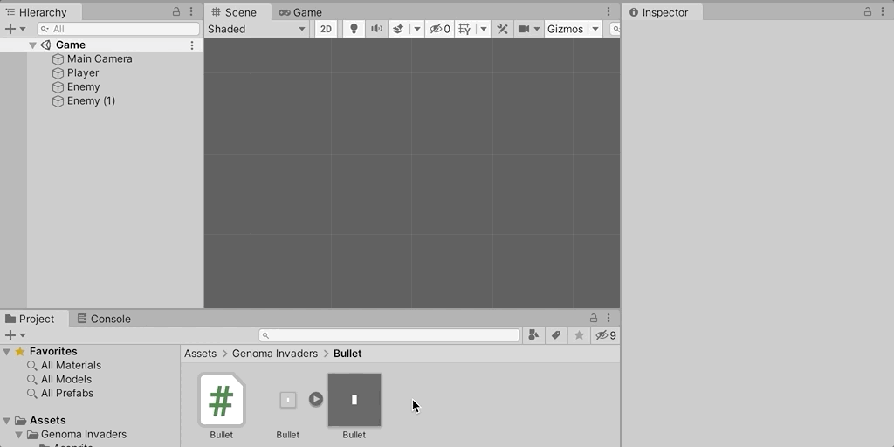

# Genoma Invaders - Unity Physics 2D Using Collider2D and Kinematic Rigidbody2D

Learn how to handle 2D game objects collisions, while making a space invaders 2D game, using the Unity physics 2D engine with help of 2D colliders and kinematic 2D rigid bodies.


## Requirements

- Complete ["**How to Move 2D Objects in Unity**"](../_tutorials/02-how-to-move-2d-objects-in-unity.md) or checkout the code from [Genoma Invaders' Github repository, branch `tutorial/02`](https://github.com/GenomaGames/genoma-invaders/tree/tutorial/02)
- [**Unity 2020.1**](https://store.unity.com/download?ref=personal)
- [**Visual Studio Editor**](https://visualstudio.microsoft.com/vs/)


## Intro

In the last tutorial, we walked through **How to Move 2D Objects in Unity** using Unity's Scripting API ending up with a Scene containing a Player Game Object that moves when pressing directional input buttons and shooting bullets that move upwards in a constant manner when a `Fire1` related input is pressed.

Our next steps will be to:
- Make Bullets collide with the Enemies
- Avoid Player to get out of screen
- Organize our code

Until now the Game Objects of our game were moving by updating its [`Transform.position`](https://docs.unity3d.com/2020.1/Documentation/ScriptReference/Transform-position.html) values by calling [`Transform.Translate`](https://docs.unity3d.com/2020.1/Documentation/ScriptReference/Transform.Translate.html) method. But, to let Unity detect collisions between objects this is a bad practice, we need to change this approach to make use of Unity's Physics 2D engine, so it can notifies us about collision between Game Objects.

## Unity's Kinematic Rigidbody2D, Moving Objects with Physics

In order to move Game Objects using Unity's 2D Physics we need to add [`Rigidbody2D`](https://docs.unity3d.com/2020.1/Documentation/Manual/class-Rigidbody2D.html) Component to them and call [`Rigidbody2D.MovePosition`](https://docs.unity3d.com/2020.1/Documentation/ScriptReference/Rigidbody2D.MovePosition.html) to move them, this way the Physics2D engine can handle the movement and take care of the physics calculations implied on it.

### Player Movement with Physics

Let's start with the Player Game Object adding the Rigidbody2D component to it.


Now there is a small point in adding physics to game objects in Unity, if you play the game you will see how our Player Game Object now falls into the abyss.


<small>_"Goodbye dear friend!"_</small>

This is because now Unity's 2D Physics engine is now applying gravity to the Player Game Object. The thing is, we don't want gravity in this game and neither to have inertia in our Game Objects. We want them to move whenever we want them to move. This means we are only going to use the Unity's 2D Physics engine to collision detection. To achieve this whe need to switch the [`Rigidbody2D.bodyType`](https://docs.unity3d.com/2020.1/Documentation/Manual/class-Rigidbody2D.html) property.

Using the Unity Inspector window change the Player's Rigidbody2D Body Type property to `Kinematic`.


<small>_**Note:** Now if you play the game will see that the Player stay still._</small>

This will make the Game Object ignore all forces and collision applied to it so it will stay still unless moved by scripting. One thing more to do with the Rigidbody2D properties is to check "Use Full Kinematics Contacts" checkbox in order to tell the Unity's 2D Physics engine that this object can collide with other kinematic objects.

<small>_**Note:** Checkout [**Unity's Manual section "Rigidbody 2D"**](https://docs.unity3d.com/2020.1/Documentation/Manual/class-Rigidbody2D.html) to have more context about this topic._</small>


There, our Player is now in position. It's time to update Player's Component code in order to make use of `RigidBody2D` instead of `Transform` to move the Player Game Object.

First we need the Player Component to depends on Rigidbody2D Component.

**`Player.cs`**

```csharp
using UnityEngine;

// https://docs.unity3d.com/2020.1/Documentation/ScriptReference/RequireComponent.html
[RequireComponent(typeof(Rigidbody2D))]
public class Player : MonoBehaviour
{
    // ...
}

```

<small>_**Note:** Some code has been hidden under `// ...` to show only relevant code._</small>

Using the [`RequireComponent`](https://docs.unity3d.com/2020.1/Documentation/ScriptReference/RequireComponent.html) Attribute, whenever Player Component is added to a Game Object if there is not Rigidbody2D Component attached, it is also added.

Now we need Player Component to store the a reference to the RigidBody2D Component in order to tomunicate with it.

**`Player.cs`**

```csharp
// ...
public class Player : MonoBehaviour
{
    [SerializeField]
    private float speed = 2;

    [SerializeField]
    private GameObject bullet;

    // https://docs.unity3d.com/2020.1/Documentation/ScriptReference/Rigidbody2D.html
    private Rigidbody2D rb2D;

    // https://docs.unity3d.com/2020.1/Documentation/ScriptReference/MonoBehaviour.Awake.html
    private void Awake()
    {
        // https://docs.unity3d.com/2020.1/Documentation/ScriptReference/Component.GetComponent.html
        rb2D = GetComponent<Rigidbody2D>();
    }

    private void Update()
    {
        // ...
    }
}

```

We have added a new method to our Player Component called [`Awake`](https://docs.unity3d.com/2020.1/Documentation/ScriptReference/MonoBehaviour.Awake.html), and inside we are using [`GetComponent`](https://docs.unity3d.com/2020.1/Documentation/ScriptReference/Component.GetComponent.html) method to obtain a reference to the attached Rigidbody2D. `Awake` method serves to hook any logic needed for our Component when the game starts a Scene or when a Game Object containning this Component is instantiated, and it is usually used to setup references like we did for the Rigidbody2D Component.

<small>_**Note:** To get more info about this topic checkout [Unity's Manual section about "Order of Execution for Event Functions"](https://docs.unity3d.com/2020.1/Documentation/Manual/ExecutionOrder.html)._</small>

Now that our Player Component has the reference to Rigidbody2D stored we can focus on the logic to move the Game Object.

**`Player.cs`**

```diff
     // ...
 
     // https://docs.unity3d.com/2020.1/Documentation/ScriptReference/Rigidbody2D.html
     private Rigidbody2D rb2D;
+    // https://docs.unity3d.com/2020.1/Documentation/ScriptReference/Vector3-zero.html
+    private Vector3 move = Vector3.zero;

     private void Awake()
     {
         // ...
     }
 
     private void Update()
     {
         // https://docs.unity3d.com/2020.1/Documentation/ScriptReference/Input.GetAxisRaw.html
         float rawHorizontalAxis = Input.GetAxisRaw("Horizontal");
 
-        // https://docs.unity3d.com/2020.1/Documentation/ScriptReference/Vector3-zero.html
-        Vector3 direction = Vector3.zero;
-        direction.x = rawHorizontalAxis;
-
-        // https://docs.unity3d.com/2020.1/Documentation/ScriptReference/Time-deltaTime.html
-        float timeSinceLastFrame = Time.deltaTime;
-
-        Vector3 translation = direction * speed * timeSinceLastFrame;
-
-        // https://docs.unity3d.com/2020.1/Documentation/ScriptReference/Transform.Translate.html
-        transform.Translate(
-          translation
-        );
+        move.x = rawHorizontalAxis;
 
         // ...
     }

+    // https://docs.unity3d.com/2020.1/Documentation/ScriptReference/MonoBehaviour.FixedUpdate.html
+    private void FixedUpdate()
+    {
+        if (move != Vector3.zero)
+        {
+            // https://docs.unity3d.com/2020.1/Documentation/ScriptReference/Time-fixedDeltaTime.html
+            Vector3 translation = move * speed * Time.fixedDeltaTime;
+            Vector3 newPosition = transform.position + translation;
+
+            // https://docs.unity3d.com/2020.1/Documentation/ScriptReference/Rigidbody2D.MovePosition.html
+            rb2D.MovePosition(newPosition);
+        }
+    }
 }
 
```

<small>_**Note:** The syntax shown here is in [`diff` unified format](https://en.wikipedia.org/wiki/Diff#Unified_format) in order to show remplaced code. Due to syntax highlighter limitations C# syntax colors are disabled._</small>

Let's explain the changes. We have removed all related old movement logic except the logic in charge of checking for movement input with [`Input.GetAxisRaw`](https://docs.unity3d.com/2020.1/Documentation/ScriptReference/Input.GetAxisRaw.html), added a new private property to `Player` class called `move` of type `Vector3` with a default value of [`Vector3.zero`](https://docs.unity3d.com/2020.1/Documentation/ScriptReference/Vector3-zero.html), then we are updating the property `move.x` value in `Player`'s `Update` method with the value retrieved from the horizontal axis input. And finally, we have defined a new method [`FixedUpdate`](https://docs.unity3d.com/2020.1/Documentation/ScriptReference/MonoBehaviour.FixedUpdate.html) to handle physincs related logic, in here, if `move` property value differs from `Vector3.zero`, it will calculate the Game Object translation based on the `move` and the `speed` values multiplying it by the passed time (in this case [`Time.fixedDeltaTime`](https://docs.unity3d.com/2020.1/Documentation/ScriptReference/Time-fixedDeltaTime.html)). This computed translation is added to the current position and then we call [`Rigidbody2D.MovePosition`](https://docs.unity3d.com/2020.1/Documentation/ScriptReference/Rigidbody2D.MovePosition.html) method to move the Game Object. This way the Player Game Object is being move by the Rigidbody2D component and taken into account b the physics engine.

If you play the game there should be no difference in the movement or any notizable changes. The difference here is that the physics engine is working behind the curtains paying attention to each movement of our Player Game Object.

### Bullet Movement with Physics

Now that we have done this with the Player let's do it with its Bullets.

Go to your Project window in the Unity editor and attach a Rigidbody2D Component to Bullet Game Object Prefab. Rememeber to set it to Kinematic and to check "Use Full Kinematics Contacts" checkbox. After this you should play the game, if everithing is configured correctly the bullets should move straight up when shooting.

Edit `Bullet.cs` code and add the `RequireComponent` attribute to require `Rigidbody2D`.

**`Bullet.cs`**

```csharp
using UnityEngine;

// https://docs.unity3d.com/2020.1/Documentation/ScriptReference/RequireComponent.html
[RequireComponent(typeof(Rigidbody2D))]
public class Bullet : MonoBehaviour
{
    // ...
}

```

Add the logic in `Bullet.cs` to store the reference to the RigidBody2D Component.

**`Bullet.cs`**

```csharp
// ...
public class Bullet : MonoBehaviour
{
    // ...

    // https://docs.unity3d.com/2020.1/Documentation/ScriptReference/Rigidbody2D.html
    private Rigidbody2D rb2D;

    // https://docs.unity3d.com/2020.1/Documentation/ScriptReference/MonoBehaviour.Awake.html
    private void Awake () {
        // https://docs.unity3d.com/2020.1/Documentation/ScriptReference/Component.GetComponent.html
        rb2D = GetComponent<Rigidbody2D>();
    }

    // ...
}

```

And finally, update its logic to move using the physics engine

**`Bullet.cs`**

```diff
// ...
 public class Bullet : MonoBehaviour
 {
     // ...
 
     // https://docs.unity3d.com/2020.1/Documentation/ScriptReference/Rigidbody2D.html
     private Rigidbody2D rb2D;
+    // https://docs.unity3d.com/2020.1/Documentation/ScriptReference/Vector3-up.html
+    private Vector3 move = Vector3.up;

     private void Awake()
     {
         // ...
     }

-    // https://docs.unity3d.com/2020.1/Documentation/ScriptReference/MonoBehaviour.Update.html
-    private void Update()
-    {
-        // https://docs.unity3d.com/2020.1/Documentation/ScriptReference/Vector3-up.html
-        Vector3 direction = Vector3.up;
-
-        // https://docs.unity3d.com/2020.1/Documentation/ScriptReference/Time-deltaTime.html
-        float timeSinceLastFrame = Time.deltaTime;
-
-        Vector3 translation = direction * speed * timeSinceLastFrame;
-
-        // https://docs.unity3d.com/2020.1/Documentation/ScriptReference/Transform.Translate.html
-        transform.Translate(
-          translation
-        );
-    }
+    // https://docs.unity3d.com/2020.1/Documentation/ScriptReference/MonoBehaviour.FixedUpdate.html
+    private void FixedUpdate()
+    {
+        if (move != Vector3.zero)
+        {
+            // https://docs.unity3d.com/2020.1/Documentation/ScriptReference/Time-fixedDeltaTime.html
+            Vector3 translation = move * speed * Time.fixedDeltaTime;
+            Vector3 newPosition = transform.position + translation;
+
+            // https://docs.unity3d.com/2020.1/Documentation/ScriptReference/Rigidbody2D.MovePosition.html
+            rb2D.MovePosition(newPosition);
+        }
+    }
 }
 
```

Notice that `Update` method has been removed since it is no longer needed and we are using the same code as with the Player Component for `FixedUpdated` method.

No changes should be noticed when playing the game (physics engine working).

### Enemies with physics

Last but not least, update the Enemies Game Objects to have a Rigidbody2D of type Kinematic and "Use Full Kinematics Contacts" checkbox checked.

And update its `Enemy.cs` Component code to require and store the reference of `Rigidbody2D`

**`Enemy.cs`**

```csharp
using UnityEngine;


[RequireComponent(typeof(Rigidbody2D))]
public class Enemy : MonoBehaviour
{
    // https://docs.unity3d.com/2020.1/Documentation/ScriptReference/Rigidbody2D.html
    private Rigidbody2D rb2D;

    // https://docs.unity3d.com/2020.1/Documentation/ScriptReference/MonoBehaviour.Awake.html
    private void Awake()
    {
        // https://docs.unity3d.com/2020.1/Documentation/ScriptReference/Component.GetComponent.html
        rb2D = GetComponent<Rigidbody2D>();
    }
}

```

This was the hardest one.

Yay! We have finished providing our Game Objects with physic properties and movement. Play the game to ensure everything moves correctly and nothing falls in to the void. It's time to make things clash.

## Unity's Collider2D, Detecting Collisions

Now that Game Objects has physical body representation the physics engine needs a way to detects collisions between these bodies this can be made using [2D Colliders](https://docs.unity3d.com/2020.1/Documentation/Manual/Collider2D.html). There are several types of Collider2D based in their shape, we will use [Box Collider 2D](https://docs.unity3d.com/2020.1/Documentation/Manual/class-BoxCollider2D.html) Component given its simplicity and that we do not need complicated shapes yet for the project.

To make a collision posible we need 2 Game Objects that have Colliders2D attached to them. We are going to make our Bullets collide with Enemies.

### Bullet to Enemy Collision

Start with the Bullet Game Object Prefab. Open the Bullet Prefab on the editor by making double click on it.



Add the Box Collider 2D Component and set its Size property to `X = 0.125` and `Y = 0.25` units. This size make the Collider area equal in size to the Sprite, the Bullet Sprite have a size of 2x4 pixels, that translated to game units (1 unit -> 16 pixel) is equal to `2 / 16 = 0.125` and `4 /16 = 0.25`.


## Unity's Static Rigidbody2D, Level Walls

--


## Conclusion

--


Happy Game Dev! :space_invader:


### Enemy Controller

Now to coding, let do the same as we did for the Player component for the first time.

**`Enemy.cs`**
```csharp
using UnityEngine;

public class Enemy : MonoBehaviour
{
    void Update()
    {
        // https://docs.unity3d.com/2020.1/Documentation/ScriptReference/Vector3-right.html
        Vector3 right = Vector3.right;

        // https://docs.unity3d.com/2020.1/Documentation/ScriptReference/Time-deltaTime.html
        float timeSinceLastFrame = Time.deltaTime;

        Vector3 translation = right * timeSinceLastFrame;

        // https://docs.unity3d.com/2020.1/Documentation/ScriptReference/Transform.Translate.html
        transform.Translate(
          translation
        );
    }
}

```

Now our enemies are fleeing to the right further and further. Don't worry bout it now, we'll deal with them later.
