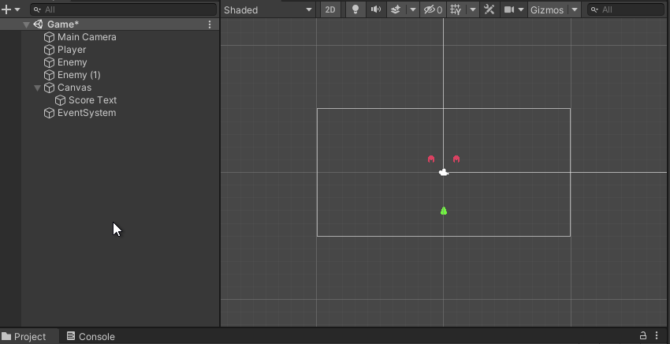

# Genoma Invaders - Using Unity UI for in-game HUDs and menus

This article covers how to implement a basic user interface to display info to the player and how to build basic start and pause menus in Unity using Unity UI.

## Requirements

- Basic knowledge with unity
- Complete ["**Unity Physics 2D Using Collider2D and Kinematic Rigidbody2D**"](../_tutorials/03-unity-physics-2d-using-collider2d-and-kinematic-rigidbody2d.md) or checkout the code from [Genoma Invaders' Github repository, branch `tutorial/03`](https://github.com/GenomaGames/genoma-invaders/tree/tutorial/03)

## Intro

Last time we end up updating all the movement logic to be handled by Unity's Physics engine and make use of its collision system in order to **detect our player's bullets colliding with the enemies to be destroyed**.

This time we'll be:
- Showing a score on the game scene
- Adding a start menu to the game that will load the first level
- Implementing a pause menu on the game

## Unity's UI

[Unity has 3 types of "UI Toolkits"](https://docs.unity3d.com/2020.1/Documentation/Manual/UIToolkits.html) that can be used to display user interfaces:

- **UIElements**: Is a new UI Toolkit in active development.
- **Unity UI**: Is the most used UI Toolkit for unity until now.
- **IMGUI**: Is a UI Toolkit commonly used to display development UIs dou its simplicity an ease to use.

We will be using [**Unity UI**](https://docs.unity3d.com/Packages/com.unity.ugui@1.0/manual/index.html) for our game UI, starting by the score display.

To display our player's score points we will need to make use of the [**Text Visual Component**](https://docs.unity3d.com/Packages/com.unity.ugui@1.0/manual/UIVisualComponents.html#text). Let's start by adding one to our Game Scene.

As you can see this will create 3 Game Objects in our Hierarchy Window, a Canvas containing Text and something called EventSystem.

- The [Canvas](https://docs.unity3d.com/2020.1/Documentation/Manual/UICanvas.html) defines an area where all the UI components will be rendered and its has different render options to help placing UI Components all over our game world (checkout the docs!), the **Render Mode** we will be using is "Screen Space - Overlay" which is set by default.
- The Text Object is the one on charge of display our text.
- The EventSystem is a subsystem in charge of controlling the UI events and inputs. It handles navigation, input activation and selection.

Select the Text Object and rename it to `Score Text`, then go to its Text Component and put a placeholder score in its Text input.

Now you may probably have notice that there is no text shown in the Scene Window. This is because the Canvas as we said is like a sticker in our camera, it is not part of the game world. to center our Game Window in the Canvas Game Object select it in the Hierarchy Window and then, with the cursor over the Game Window, press <kbd>F</kbd>, this will move the Game Window view to fit whatever Game Object you have selected.

## Conclusion

CONCLUSION_CONTENT

You can get the code generated by following this tutorial in [Genoma Invaders' Github repository, branch `TUTORIAL_BRANCH`](https://github.com/GenomaGames/genoma-invaders/tree/TUTORIAL_BRANCH).

Happy Game Dev! :space_invader: