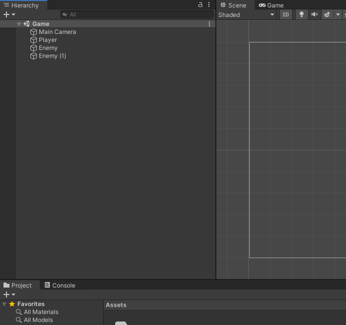
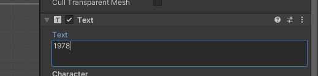
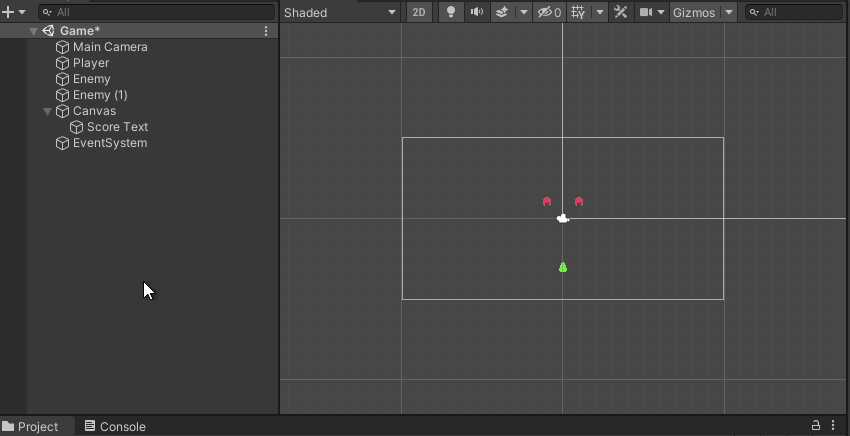
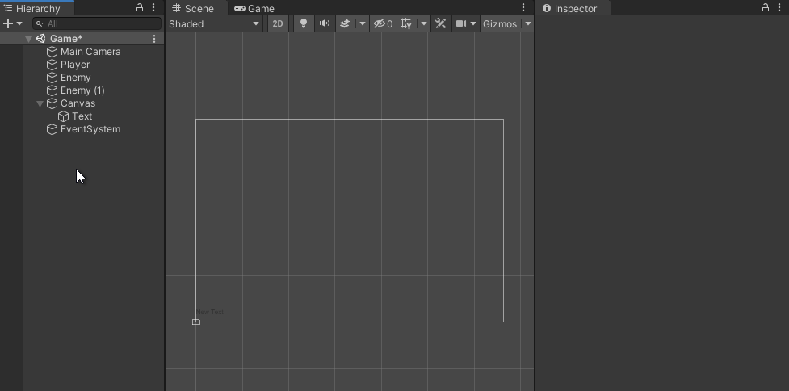
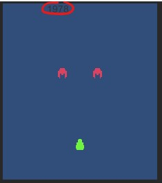
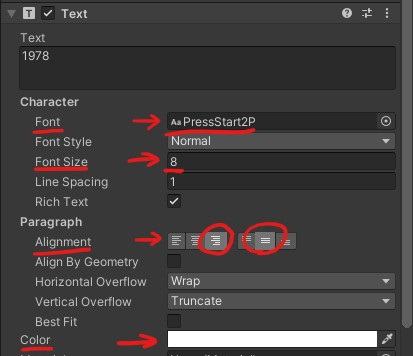
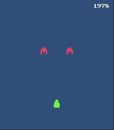
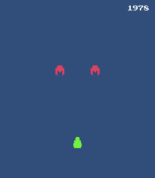

# Genoma Invaders - Using Unity UI for in-game HUDs

This article covers how to implement a basic **U**ser **I**nterface on Unity using Unity UI to display info to players.


## Requirements

- Basic knowledge of Unity
- Complete ["**Unity Physics 2D Using Collider2D and Kinematic Rigidbody2D**"](../_tutorials/03-unity-physics-2d-using-collider2d-and-kinematic-rigidbody2d.md) or checkout the code from [Genoma Invaders' Github repository, branch `tutorial/03`](https://github.com/GenomaGames/genoma-invaders/tree/tutorial/03)


## Intro

Last time we end up updating all the movement logic to be handled by Unity's Physics engine and make use of its collision system to **detect our player's bullets colliding with the enemies to be destroyed**.

This time we'll be showing the Score Points on the game screen.

## Unity's UI

[Unity has three types of "UI Toolkits"](https://docs.unity3d.com/2020.1/Documentation/Manual/UIToolkits.html)  to display user interfaces:

- **UIElements**: This is a new UI Toolkit in active development.
- **Unity UI**: This is the most used UI Toolkit for Unity until now.
- **IMGUI**: This is a UI Toolkit commonly used to display development UIs due to its simplicity and ease to use.

We will be using [**Unity UI**](https://docs.unity3d.com/Packages/com.unity.ugui@1.0/manual/index.html) for our game UI, starting with the score display.

To display our player's score points, we will need to use the [**Text Visual Component**](https://docs.unity3d.com/Packages/com.unity.ugui@1.0/manual/UIVisualComponents.html#text). Let's start by adding one to our Game Scene.



### Canvas and Layout

As you can see, this will create 3 Game Objects in our Hierarchy Window, a Canvas containing Text, and something called EventSystem.

- The [Canvas](https://docs.unity3d.com/2020.1/Documentation/Manual/UICanvas.html) serves to define an area that will render UI components. It has different render options to help place UI Components all over our game world (checkout the docs!). The **Render Mode** we will be using is the "Screen Space - Overlay" set by default.
- The Text Object is the one in charge of display our text.
- The EventSystem is a subsystem in charge of controlling the UI events and inputs. It handles navigation, input activation, and selection.


Select the Text Object and rename it to `Score Text`, then go to its Text Component and put some placeholder score in its Text input (like `1978`) to have a reference of how it would look.



Now you may probably have noticed that there is no text shown in the Scene Window. This happens because the Canvas, as we said, is like a sticker in our camera, it is not part of the game world. To center our Game Window in the Canvas Game Object, select it in the Hierarchy Window and then, with the cursor over the Game Window, press <kbd>F</kbd>, this will move the Game Window view to fit the Game Object you have selected, in this case, the Canvas.



With the canvas on sigh now, it's time to position the Score Text, select it, and in its Inspector Window under the Rect Transform section, click on the icon similar to a red reticle, this is the Anchor Presets selector. Now with the Anchor Presets selector opened when pressing <kbd>Shift</kbd>+<jbd>Alt</kbd> you'll see that the selection icon change, select the one under the row with "top" label and the column with "right" label while pressing <kbd>Shift</kbd>+<jbd>Alt</kbd>. This will place the Score Text Object on the top right corner of the Canvas and anchor it.



<small>_**Note:** You can read more about Rect Transform Component in [Unity UI Documentation - Basic Layout section](https://docs.unity3d.com/Packages/com.unity.ugui@1.0/manual/UIBasicLayout.html)_</small>

If you now switch to Game Window should see something like this.



### Unity UI Text Style

Now that our Text is positioned in the Canvas, let's give it some styles and appearance similar to our game visuals.

First, we are going to change the font used for the text. We'll be using **Press Start 2P** you can download it from [codeman38's webpage](http://www.zone38.net/font/#pressstart) (the author). We placed the fonts under `/Assets/Genoma Invaders/Fonts/Press Start P2/` to organize the project's files.

To change the font for the Score Text Object:
1. Select it and change the Font Property under its Text Component.
1. Set its Font Size Property to `8` (this is the recommended size for this font),
1. Update the Alignment to the right and centered vertically.
1. Update the Color Property to be White (`FFFFFF`).



As a final tweak to adjust the size and position of the element, go to the Score Text Object's Rect Transform Component and set the next properties:
- Pos X: -8
- Pos Y: -8
- Pos Z: 0
- Width: 64
- Height: 8

<small>_**Note:** You should see the changes applied in the Game Window (remember to set the Taito 8080 resolution configured in the [first lesson](./01-getting-started-with-unity-2d-game-development.md/#arcade-cabinet-taito-8080))._</small>



### Updating Unity UI Text

The Score Text Object is ready to display our Game Score, and now we need some logic to update its Text value.

Create a new C# Script in the Project Window called `Score.cs` and place it under `/Assets/Genoma Invaders/UI/` (new folder). We will use this Component to maintain the Score points for our Game.

**`Score.cs`**
```csharp
using UnityEngine;
using UnityEngine.UI;

public class Score : MonoBehaviour
{
    private int score = 0;
    // https://docs.unity3d.com/Packages/com.unity.ugui@1.0/manual/script-Text.html
    private Text text;

    // https://docs.unity3d.com/2020.1/Documentation/ScriptReference/MonoBehaviour.Awake.html
    private void Awake()
    {
        text = GetComponent<Text>();
    }

    // https://docs.unity3d.com/2020.1/Documentation/ScriptReference/MonoBehaviour.Start.html
    private void Start()
    {
        text.text = score.ToString();
    }

    public void AddScore (int points)
    {
        score += points;

        text.text = score.ToString();
    }
}

```

The previous code does set the Text value to the initial score (`0`) whenever the Game Starts and update it when someone calls the method `AddScore`. Attach it to the Score Text Object and Play the Game, you should see the Score Points to `0`.

With this new Component attached to the Text Score Object, we can use the `Score.AddScore` method to increment our Game Score. Let's update the `Enemy.cs` to communicate with the Score Component inside the Score Text Object. We need to find and store a reference to the Score Component to call its `AddScore` method whenever the player kills an Enemy.

**`Enemy.cs`**
```csharp
// ...
public class Enemy : MonoBehaviour
{
    // ...

    private Score score;

    private void Awake()
    {
        // ...

        // https://docs.unity3d.com/2020.1/Documentation/ScriptReference/Object.FindObjectOfType.html
        score = FindObjectOfType<Score>();
    }

    // https://docs.unity3d.com/2020.1/Documentation/ScriptReference/MonoBehaviour.OnDestroy.html
    private void OnDestroy()
    {
        score.AddScore(100); // Increment game score by 100
    }
}

```

This way, whenever [`Destroy`](https://docs.unity3d.com/2020.1/Documentation/ScriptReference/Object.Destroy.html) method is called (remember that the Bullet Component is calling this method over the Enemy Object) with a Game Object containing an Enemy Component, it will update the Score points before being destroyed from the Scene.

Let's try it



## Conclusion

We ended up with a game displaying a score text that updates whenever an enemy is killed and learning a bit about Unity UI systems.

You can get the code generated by following this tutorial in [Genoma Invaders' Github repository, branch `tutorial/04`](https://github.com/GenomaGames/genoma-invaders/tree/tutorial/04).

Happy Game Dev! :space_invader: